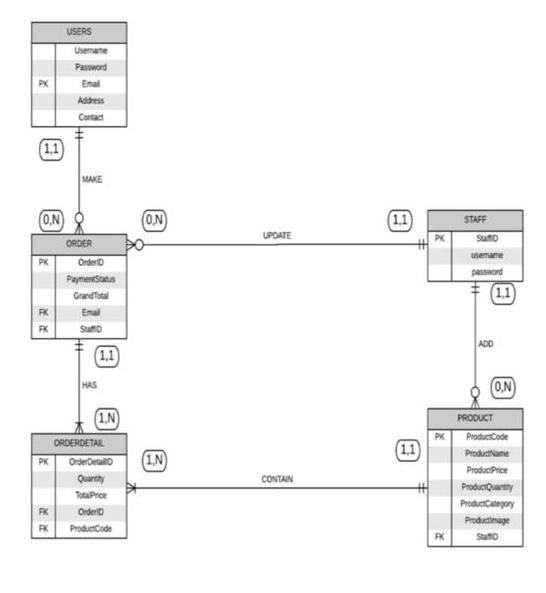
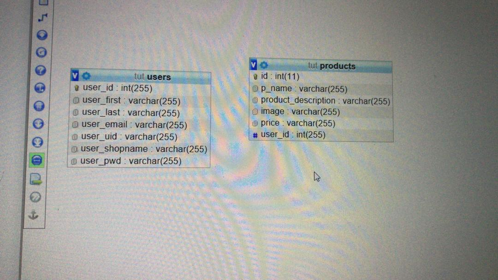
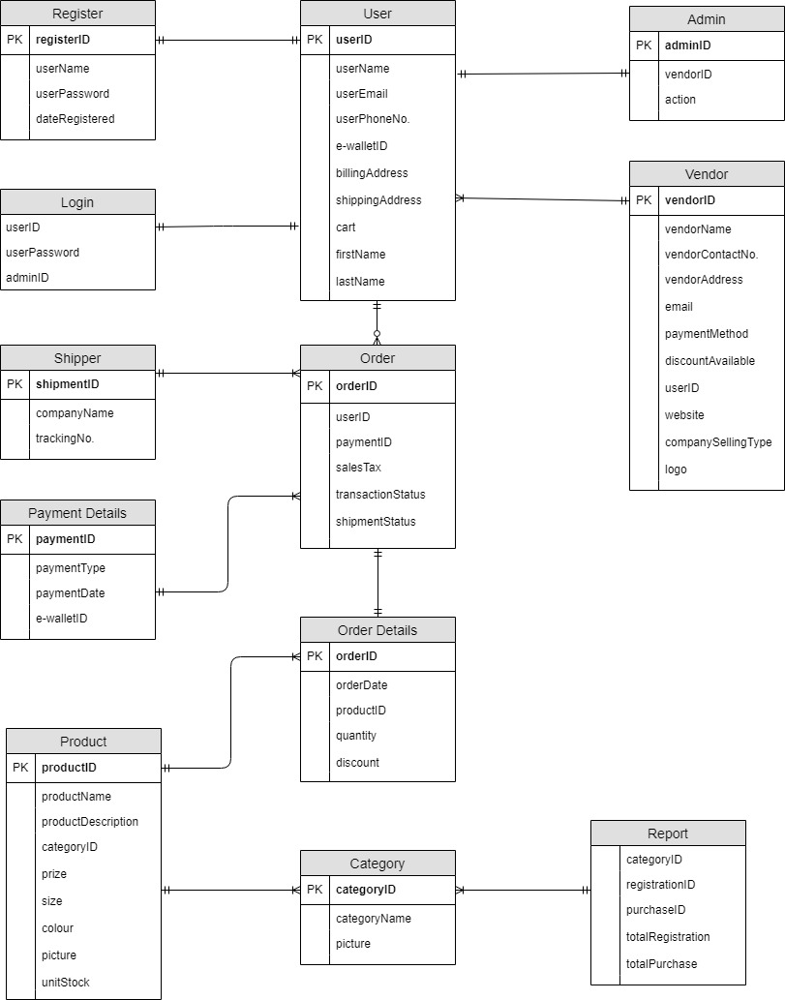
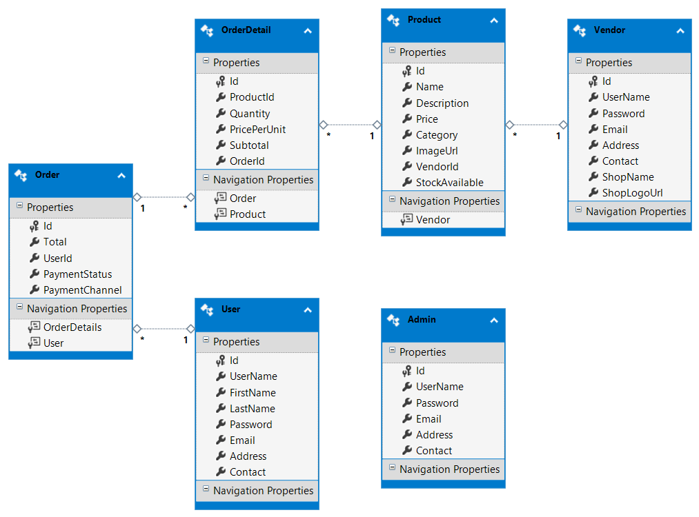
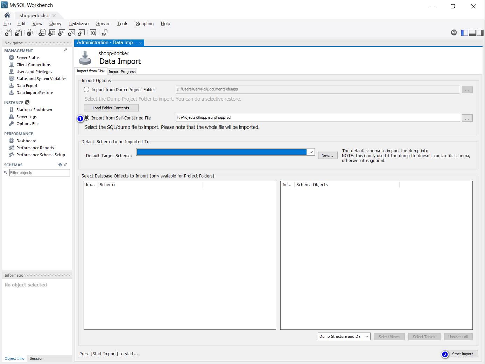

# Shopp

PHP E-Commerce site

<span>_Group 1 - Database design and backend setup_</span> <!-- .element: class="fragment" -->

---

# Database design

ERD

---



Group Sarmela

---



Group Nazmi

---



Group Eugene

---



---

## Relationships

1. each `User` can have multiple `Order`
1. each `Order` can have multiple `OrderDetail`
1. each `OrderDetail` can have one `Product`
1. each `Product` belongs to one `Vendor`
1. `Admin`

---

## Possible extension points

1. persist items in `Cart`
1. choosing `Shipment` method tracking status
1. displaying `Promotion` offered by `Vendor`

---

_any questions/add ons?_

---

# Connecting PHP and MySql

---

## `config.php`

stores variables related to the database <!-- .element: class="fragment" -->

---

```php
<?php
$DB_HOST = 'mysql';
// $DB_HOST = 'localhost'

$DB_NAME = 'shopp';
$DB_USER = 'shopp';
$DB_PASSWORD = 'shopp';
?>
```

---

if you are using `XAMPP`,

replace `$DB_HOST = 'mysql';`

with `$DB_HOST = 'localhost';`

---

## `main.php`

<span>a barebone example of connecting to MySQL and retrieve some `Products`</span> <!-- .element: class="fragment" -->

---

```php
require_once 'config.php';
```

<span>include the file `config.php` so that we can use the variables defined inside</span> <!-- .element: class="fragment" -->

---

```php
class Product
{
    public $Id;
    public $Name;
    public $Price;
    public $Category;
    public $ImageUrl;
}
```

define a class that will be used to hold the result coming back from the database <!-- .element: class="fragment" -->

---

```php
try {
    $connection = new PDO("mysql:host=$DB_HOST;dbname=$DB_NAME", $DB_USER, $DB_PASSWORD);
} catch (PDOException $e) {
    die("Unable to connect to database $DB_NAME at $DB_HOST\n" . $e->getMessage());
}
```

<span>establish a connection to the MySQL database using `PDO` (`PHP Data Objects`) using the variables defined in `config.php`</span> <!-- .element: class="fragment" -->

<span>if it fails, print the error message and exit</span> <!-- .element: class="fragment" -->

---

```php
$sql = 'SELECT *
        FROM Products';
$products = $connection->query($sql);
```

<span>constructs and executes the SQL query to get all `Products` from the database</span> <!-- .element: class="fragment" -->

---

you should use

1. `prepare`
1. `execute`

to prevent SQL injection

https://phpdelusions.net/pdo#prepared

---

```php
// ...
<?php while ($product = $products->fetchObject('Product')) {
    echo '<tr>';
    echo '<td> ' . $product->Name . '</td>';
    echo '<td> ' . $product->Price . '</td>';
    echo '<td> ' . $product->Category . '</td>';
    echo '<td> ImageUrl . '&sig=' . $p
    echo '</tr>';
}
// ...
```

<span>loop through all the rows and construct a table from it</span>

---

before jumping into the demo

here is how the

# folders are structured <!-- .element: class="fragment" -->

---

```
├─docs
│  └─erd
│          Shopp.png
├─slides
├─sql
│  │  Shopp.sql
│  └─database-init
└─src
    ├─database-init
    │  └─Shopp
    └─web
        │  config.php
        │  main.php
        └─laradock
```

---

instead of using `XAMPP`, I used `laradock`

<span>if you have `docker` installed, you can just run one command to get the same development environment as mine</span> <!-- .element: class="fragment" -->

_which eliminates the problem of "it-works-on-my-machine!"_ <!-- .element: class="fragment" -->

---

# `docker`

can be seen as a lightweight virtual machine, or a _container_

https://www.docker.com/

---

# `laradock`

a PHP development environment for `docker`

https://laradock.io/

---

# but... 

you can still use `XAMPP` if you want to

---

# Demo

---

## getting the code

by either `git` cloning, or just copy from the `cd`

https://github.com/garyng/Shopp

---

## Cloning from GitHub

```
git clone git@github.com:garyng/Shopp.git
```

note:
start vscode

---

## starting the development environment

1. `mysql`
1. `apache2`

_the same thing if you are using XAMPP, but you will need to copy this folder into your XAMPP folder_

---

```
pushd src\web\laradock
docker-compose up apache2 mysql
```
---

## `main.php`

my server is running at port `8080`, change it according to your XAMPP settings

http://localhost:8080/main.php

note:
show with MySQL Workbench

---

## creating and seeding the database

you can import the `Shopp.sql` file, or use the application under `database-init`.

---

### `database-init`

```
pushd sql\database-init
Shopp.exe
```

---

### `Shopp.sql`

import it with `PHPMyAdmin` or `MySQL Workbench`

note:
drop database first

---


---

## checking the database

with `MySQL Workbench` or `PHP My Admin`

---

## done!

http://localhost:8080/main.php

---

## thanks!
